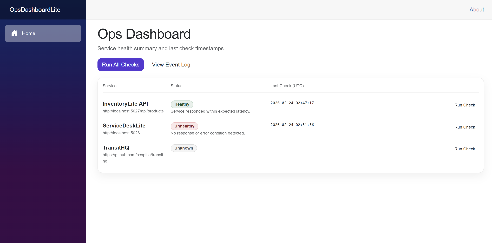
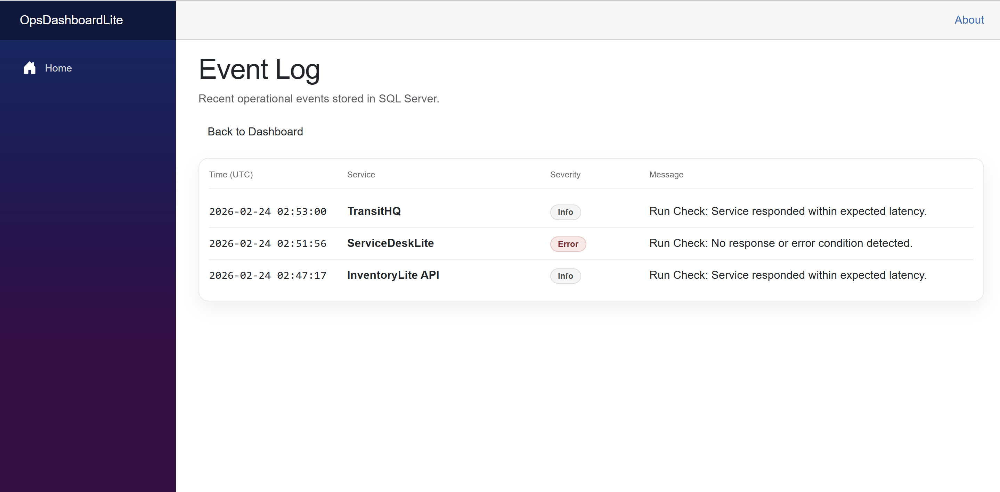

# OpsDashboardLite

OpsDashboardLite is a Blazor Server reliability dashboard MVP that demonstrates service health monitoring, event logging, and SQL Server persistence using the Microsoft .NET ecosystem.

This project simulates a lightweight operations monitoring system similar to internal enterprise dashboards used for tracking service availability and system events.

---

## Overview

The dashboard provides:

- Service status tracking (health state + last check time)
- Event log storage in SQL Server
- "Run Check" action that simulates service checks and persists results
- Clean separation between UI, data access, and persistence layers

This project showcases enterprise patterns including dependency injection, EF Core data modeling, relational schema design, and Docker-based infrastructure.

---

## Architecture

Blazor Server → EF Core → SQL Server (Docker)

- UI layer: Blazor Server components
- Data layer: Entity Framework Core
- Persistence: SQL Server 2022 (Docker container)
- Background processing: simulated health checks
- Structured relational schema

---

## Tech Stack

- Blazor Server
- C# / .NET 10
- Entity Framework Core
- SQL Server 2022 (Docker)
- Dependency Injection
- GitHub version control
- Structured documentation

---

## Features

### Service Monitoring

Each monitored service tracks:

- Service Name
- Current Health Status (Healthy / Degraded / Unhealthy)
- Last Check Timestamp

### Event Logging

Each simulated check generates:

- Severity level
- Timestamp (UTC)
- Message
- Associated service

All events are persisted in SQL Server.

### Run Check Simulation

The “Run Check” action:

- Simulates health state transitions
- Updates service status
- Persists an event log entry
- Refreshes dashboard state

---

## Database Schema

Tables:

- MonitoredServices
- EventLogs

Relational structure:

- EventLogs reference MonitoredServices via foreign key
- Normalized design for reporting and analytics

---

## Running Locally

### 1) Start SQL Server (Docker)

```bash
docker rm -f odl-sqlserver 2>/dev/null || true

docker run \
  -e "ACCEPT_EULA=Y" \
  -e "MSSQL_SA_PASSWORD=Str0ngPassw0rd" \
  -p 1434:1433 \
  --name odl-sqlserver \
  -d mcr.microsoft.com/mssql/server:2022-latest

---

## Screenshots
### Dashboard 


### Dashboard Run Check
![Dashboard Run Check](docs/screenshots/dashboard-run-check.png

### Event Log

